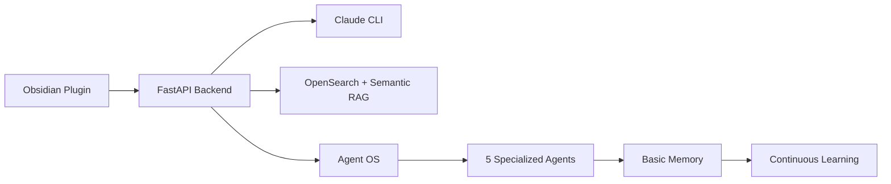

# Obsidian Copilot: Claude-Exclusive Edition with Agent OS

[](https://claude.ai)
[](https://www.anthropic.com)
[](./docs/agents/overview.md)
[](./LICENSE)

> **⚡ PRIVATE CUSTOM IMPLEMENTATION**  
> An intelligent knowledge companion powered by Claude's 200K context window and 5 autonomous agents.  
> Fork of [obsidian-copilot](https://github.com/logancyang/obsidian-copilot) optimized for Claude + Agent OS.

## 🌟 Key Features

### 🧠 Claude Integration
- **200K Context Window** - Analyze entire documents, not fragments
- **Three Context Strategies** - Full docs, smart chunks, or hierarchical
- **Local Processing** - Privacy-first with Claude CLI

### 🤖 Five Autonomous Agents
- **Vault Analyzer** - Daily pattern detection and insights
- **Synthesis Assistant** - Multi-document synthesis
- **Context Optimizer** - Continuous performance tuning
- **Suggestion Engine** - Proactive recommendations
- **Research Assistant** - Deep knowledge exploration

### 💾 Intelligent Memory
- **Basic Memory Integration** - Agents learn and remember
- **Knowledge Graphs** - Semantic connections between memories
- **Continuous Learning** - Improves with every interaction

## 🚀 Quick Start

```bash
# 1. Clone repository
git clone https://github.com/caioniehues/obsidian-copilot.git
cd obsidian-copilot

# 2. Set environment (path MUST end with /)
export OBSIDIAN_PATH=/path/to/vault/
export TRANSFORMER_CACHE=~/.cache/huggingface/hub

# 3. Build and start
make build && make opensearch
# Wait 30 seconds, then in new terminal:
make build-artifacts && make run

# 4. Install plugin
cd plugin && npm install && npm run build
cd .. && make install-plugin
```

Enable in Obsidian: Settings → Community Plugins → Obsidian Copilot

## 📚 Documentation

### Setup & Installation
- 📋 [System Requirements](./docs/setup/requirements.md)
- 🛠️ [Installation Guide](./docs/setup/installation.md)
- ⚡ [Quick Start (5 min)](./docs/setup/quick-start.md)

### Usage Guides
- 🚀 [Getting Started](./docs/usage/getting-started.md)
- 📖 [Basic Usage](./docs/usage/basic-usage.md)
- 🤖 [Agent Commands](./docs/usage/agent-commands.md)
- 🔬 [Advanced Features](./docs/usage/advanced.md)

### Agent Documentation
- 🧩 [Agent OS Overview](./docs/agents/overview.md)
- 🔍 [Individual Agent Guides](./docs/agents/)
- 🧠 [Agent Memory System](./docs/architecture/agent-memory.md)

### Technical Reference
- 🏗️ [Architecture](./docs/architecture/system-design.md)
- 📡 [API Reference](./docs/architecture/api-reference.md)
- 🔧 [Troubleshooting](./docs/troubleshooting/common-issues.md)

## 🎯 Basic Usage

In any Obsidian note:

```markdown
## What is machine learning?

## agent:synthesize
Create a synthesis of my productivity notes

## agent:research depth=comprehensive
Deep dive into quantum computing

## agent:suggest
What should I explore next?
```

## 🏗️ Architecture



## ⚙️ Configuration

### Context Strategies

| Strategy | Use Case | Tokens | Speed |
|----------|----------|---------|-------|
| `full_docs` | Complete understanding | 150-200K | 10-15s |
| `smart_chunks` | Balanced (default) | 50-100K | 5-10s |
| `hierarchical` | Quick overview | 30-50K | 2-5s |

### Agent Configuration

Edit `.agent-os/agents/config.yaml`:

```yaml
agents:
  vault-analyzer:
    enabled: true
    trigger:
      interval: daily
      time: "02:00"
```

## 🔒 Privacy & Security

- ✅ **Local Processing** - All indexing and retrieval on your machine
- ✅ **No Telemetry** - Zero usage tracking
- ✅ **Secure API** - Only Claude calls leave your system
- ✅ **Your Data** - Complete control over your vault

## 🤝 Contributing

This is a private fork. For the original project, see [obsidian-copilot](https://github.com/logancyang/obsidian-copilot).

## 📄 License

MIT License - See [LICENSE](./LICENSE)

## 🙏 Acknowledgments

- Original [obsidian-copilot](https://github.com/logancyang/obsidian-copilot) by Logan Yang
- [Claude](https://claude.ai) by Anthropic
- [Basic Memory](https://github.com/waldzx/basic-memory) for semantic knowledge
- [OpenSearch](https://opensearch.org) for robust retrieval

---

<div align="center">
  <b>Built with ❤️ for the Obsidian + Claude power user</b>
  <br>
  <a href="./docs/README.md">📚 Full Documentation</a> • 
  <a href="./docs/setup/quick-start.md">⚡ Quick Start</a> • 
  <a href="./docs/troubleshooting/common-issues.md">🔧 Troubleshooting</a>
</div>