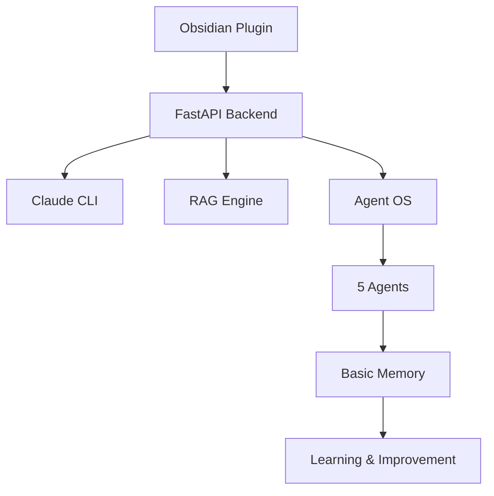

# 📚 Obsidian Copilot Documentation

> Complete documentation for Obsidian Copilot with Claude + Agent OS

## 🚀 Quick Links

| Getting Started | Core Features | Advanced | Specialized |
|-----------------|---------------|----------|-------------|
| [Installation Guide](./setup/installation.md) | [Basic Usage](./usage/basic-usage.md) | [Agent Commands](./usage/agent-commands.md) | [Claude Features](./features/claude-features.md) |
| [Quick Start (5 min)](./setup/quick-start.md) | [Getting Started](./usage/getting-started.md) | [Advanced Features](./usage/advanced-features.md) | [Migration Guide](./migration/migration-guide.md) |
| [Requirements](./setup/requirements.md) | [Daily Workflows](./usage/basic-usage.md#daily-workflows) | [API Reference](./architecture/api-reference.md) | [Troubleshooting](./troubleshooting/common-issues.md) |

## 📖 Documentation Structure

### 🛠️ Setup & Installation
- **[Requirements](./setup/requirements.md)** - System requirements and prerequisites
- **[Installation Guide](./setup/installation.md)** - Complete step-by-step setup
- **[Quick Start](./setup/quick-start.md)** - Get running in 5 minutes

### 👤 Usage Guides
- **[Getting Started](./usage/getting-started.md)** - Your first 10 minutes
- **[Basic Usage](./usage/basic-usage.md)** - Core features and commands
- **[Agent Commands](./usage/agent-commands.md)** - Complete agent reference
- **[Advanced Features](./usage/advanced-features.md)** - Power user features

### 🤖 Agent Documentation
- **[Agent Overview](./agents/overview.md)** - Understanding the Agent OS
- **[API Reference](./agents/api-reference.md)** - Complete Agent OS API documentation
- **[Troubleshooting](./agents/troubleshooting.md)** - Advanced troubleshooting and configuration
- **[Vault Analyzer](./agents/vault-analyzer.md)** - Autonomous vault analysis
- **[Synthesis Assistant](./agents/synthesis.md)** - Multi-document synthesis
- **[Context Optimizer](./agents/context-optimizer.md)** - Performance optimization
- **[Suggestion Engine](./agents/suggestions.md)** - Proactive recommendations
- **[Research Assistant](./agents/research.md)** - Deep research capabilities

### 🏗️ Architecture & Technical
- **[System Design](./architecture/system-design.md)** - Architecture overview
- **[Agent Memory](./architecture/agent-memory.md)** - How agents learn
- **[API Reference](./architecture/api-reference.md)** - Complete API documentation

### ⭐ Claude-Exclusive Features
- **[Claude Features](./features/claude-features.md)** - 200K context window, advanced analysis, and Claude-specific capabilities
- **[Migration Guide](./migration/migration-guide.md)** - Upgrading from OpenAI-only version to Claude integration

### 🔧 Troubleshooting & Support
- **[Common Issues](./troubleshooting/common-issues.md)** - Solutions to frequent problems with enhanced debugging
- **[Agent Troubleshooting](./agents/troubleshooting.md)** - Advanced agent diagnostics and configuration
- **[FAQ](./troubleshooting/faq.md)** - Frequently asked questions

## 🎯 Start Here

### New Users
1. Check [Requirements](./setup/requirements.md)
2. Follow [Installation Guide](./setup/installation.md)
3. Read [Getting Started](./usage/getting-started.md)
4. Explore [Basic Usage](./usage/basic-usage.md)

### Experienced Users
1. Use [Quick Start](./setup/quick-start.md)
2. Jump to [Agent Commands](./usage/agent-commands.md)
3. Explore [Advanced Features](./usage/advanced-features.md)
4. Try [Claude Features](./features/claude-features.md)

### Migrating Users
1. Review [Migration Guide](./migration/migration-guide.md)
2. Understand [Claude Features](./features/claude-features.md)
3. Configure backend preferences
4. Test both OpenAI and Claude backends

### Developers
1. Review [System Design](./architecture/system-design.md)
2. Check [Agent API Reference](./agents/api-reference.md)
3. Understand [Agent Memory](./architecture/agent-memory.md)
4. Use [Advanced Troubleshooting](./agents/troubleshooting.md)

## 🌟 Key Features

### Claude Integration
- **200K context window** - Process entire books and research collections
- **Three context strategies** - Full docs, smart chunks, and hierarchical
- **Local processing via CLI** - No API key required for Claude
- **Advanced analysis** - Vault-wide insights and multi-document synthesis
- [→ Learn more about Claude features](./features/claude-features.md)

### Agent OS
- **5 specialized autonomous agents** - Vault Analyzer, Synthesis Assistant, Context Optimizer, Suggestion Engine, Research Assistant
- **Continuous learning via Basic Memory** - Agents build understanding over time  
- **Pattern detection and insights** - Proactive discovery of knowledge connections
- **Configurable automation** - Customizable agent behavior and scheduling
- [→ Explore agent capabilities](./agents/overview.md)

### RAG System
- **Dual search (OpenSearch + Semantic)** - Keyword and meaning-based retrieval
- **Graph-aware retrieval** - Understands document relationships
- **Smart chunking strategies** - Preserves context and structure
- **Performance optimization** - Caching and efficient indexing
- [→ Technical details](./architecture/system-design.md)

## 📊 System Overview

## 🔗 External Resources

### Related Projects
- [Original Obsidian Copilot](https://github.com/logancyang/obsidian-copilot) - Original OpenAI-only version
- [Basic Memory MCP](https://github.com/waldzx/basic-memory) - Agent memory system
- [Claude by Anthropic](https://claude.ai) - AI assistant with 200K context
- [Claude Code CLI](https://claude.ai/code) - Local Claude integration

### Community & Support
- [GitHub Issues](https://github.com/caioniehues/obsidian-copilot/issues) - Bug reports and feature requests
- [Discussions](https://github.com/caioniehues/obsidian-copilot/discussions) - Community Q&A and ideas
- [Troubleshooting Guide](./troubleshooting/common-issues.md) - Solutions to common problems

## 📝 Documentation Status

| Section | Status | Last Updated | Files |
|---------|--------|--------------|-------|
| Setup & Installation | ✅ Complete | 2025-08-18 | 3 guides |
| Usage Guides | ✅ Complete | 2025-08-18 | 4 guides |
| Agent Documentation | ✅ Complete | 2025-08-18 | 8 guides |
| Architecture | ✅ Complete | 2025-08-18 | 3 references |
| Claude Features | ✅ Complete | 2025-08-18 | 1 comprehensive guide |
| Migration Guide | ✅ Complete | 2025-08-18 | 1 step-by-step guide |
| Troubleshooting | ✅ Complete | 2025-08-18 | 3 diagnostic guides |

## 🤝 Contributing to Docs

Found an issue or want to improve documentation?
1. Check existing [issues](https://github.com/caioniehues/obsidian-copilot/issues)
2. Submit corrections via pull request
3. Suggest improvements in discussions
4. Help translate or add examples

### Documentation Structure
All documentation follows a clear hierarchy:
- **Setup** - Installation and configuration
- **Usage** - User guides and workflows  
- **Agents** - Agent-specific documentation
- **Architecture** - Technical references
- **Features** - Claude-specific capabilities
- **Migration** - Upgrade instructions
- **Troubleshooting** - Problem resolution

---

**Navigation**: [Home](../README.md) | [Setup →](./setup/installation.md) | [Quick Start →](./setup/quick-start.md)