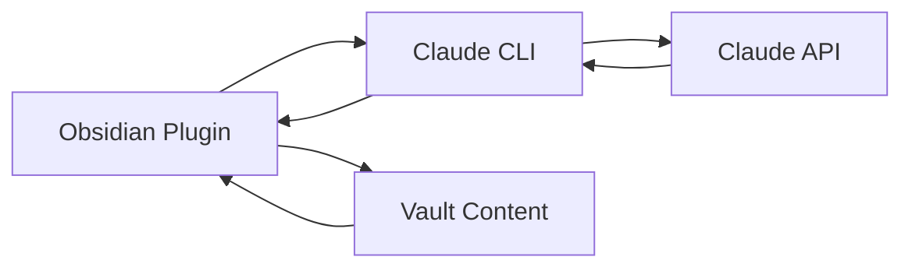

# 📚 Obsidian Claude CLI Chat Plugin Documentation

> Complete documentation for the streamlined Claude CLI integration plugin

## 🚀 Quick Links

| Getting Started | Core Features | Technical | Support |
|-----------------|---------------|-----------|----------|
| [Installation](./INSTALLATION.md) | [Usage Guide](./USAGE.md) | [Architecture](./ARCHITECTURE.md) | [Troubleshooting](./TROUBLESHOOTING.md) |
| [Setup Process](./INSTALLATION.md#installation) | [Chat Interface](./USAGE.md#basic-chat-workflow) | [Implementation](./IMPLEMENTATION.md) | [FAQ](./TROUBLESHOOTING.md#common-issues-and-solutions) |
| [Requirements](./INSTALLATION.md#requirements) | [Settings](./USAGE.md#settings-configuration) | [Testing](./TESTING.md) | [Community Support](./TROUBLESHOOTING.md#community-support) |

## 📖 Documentation Overview

### 🏁 Getting Started
- **[Installation Guide](./INSTALLATION.md)** - Step-by-step setup process
- **[Usage Guide](./USAGE.md)** - Complete user manual with examples
- **[Troubleshooting](./TROUBLESHOOTING.md)** - Common issues and solutions

### 🔧 Technical Documentation
- **[Architecture](./ARCHITECTURE.md)** - System design and plugin structure
- **[Implementation](./IMPLEMENTATION.md)** - Development details and code structure  
- **[Testing Guide](./TESTING.md)** - Test-driven development approach
- **[API Reference](./API.md)** - Plugin APIs and integration points

### 📝 Change Documentation
- **[Changelog](./CHANGELOG.md)** - Version history and updates
- **[Transformation](./TRANSFORMATION.md)** - RAG → Local CLI migration details

## 🎯 Start Here

### New Users
1. Check [Requirements](./INSTALLATION.md#requirements)
2. Follow [Installation Guide](./INSTALLATION.md#installation)  
3. Read [Usage Guide](./USAGE.md#opening-the-chat-panel)
4. Configure [Settings](./USAGE.md#settings-configuration)

### Developers
1. Review [Architecture](./ARCHITECTURE.md)
2. Understand [Implementation](./IMPLEMENTATION.md)
3. Set up [Testing Environment](./TESTING.md)
4. Check [API Reference](./API.md)

## 🌟 Key Features

### Local Claude CLI Integration
- **Zero Configuration** - Works immediately with Claude CLI installed
- **Complete Privacy** - All processing happens locally on your machine
- **No API Keys Required** - Uses your existing Claude Code subscription
- **Real-time Streaming** - Live responses as Claude generates them

### Simplified Architecture
- **Single Plugin** - No backend services or containers required  
- **Direct Communication** - Plugin → Claude CLI → Claude API
- **Lightweight** - Minimal resource usage and fast startup
- **Reliable** - Single point of communication reduces failure modes

### Smart Vault Integration  
- **Configurable Access** - Choose exactly what Claude can see
- **Context-Aware** - Optional vault integration for informed responses
- **Safe by Default** - Vault access requires explicit user permission
- **Performance Optimized** - Efficient context processing

## 📊 Architecture Overview

## 🔗 External Resources

### Related Projects
- [Original Obsidian Copilot](https://github.com/logancyang/obsidian-copilot) - Original complex RAG system
- [Claude Code CLI](https://claude.ai/code) - Local Claude integration tool
- [Obsidian Plugin Development](https://docs.obsidian.md/Plugins) - Official plugin documentation

### Community & Support
- [GitHub Issues](https://github.com/caioniehues/obsidian-copilot/issues) - Bug reports and feature requests
- [Discussions](https://github.com/caioniehues/obsidian-copilot/discussions) - Community Q&A and ideas
- [Obsidian Forum](https://forum.obsidian.md) - General Obsidian support

## 📝 Documentation Status

| Document | Status | Last Updated | Description |
|----------|--------|--------------|-------------|
| [Installation](./INSTALLATION.md) | ✅ Complete | 2025-08-19 | Setup and configuration guide |
| [Usage](./USAGE.md) | ✅ Complete | 2025-08-19 | Complete user manual |
| [Architecture](./ARCHITECTURE.md) | ✅ Complete | 2025-08-19 | Technical system overview |
| [Implementation](./IMPLEMENTATION.md) | ✅ Complete | 2025-08-19 | Development documentation |
| [Testing](./TESTING.md) | ✅ Complete | 2025-08-19 | TDD approach and test coverage |
| [Troubleshooting](./TROUBLESHOOTING.md) | ✅ Complete | 2025-08-19 | Issue resolution guide |
| [API Reference](./API.md) | ✅ Complete | 2025-08-19 | Plugin APIs and interfaces |
| [Changelog](./CHANGELOG.md) | ✅ Complete | 2025-08-19 | Version history |
| [Transformation](./TRANSFORMATION.md) | ✅ Complete | 2025-08-19 | Migration documentation |

## 🤝 Contributing to Documentation

Found an issue or want to improve documentation?

1. **Report Issues** - Use [GitHub Issues](https://github.com/caioniehues/obsidian-copilot/issues) for bugs or suggestions
2. **Submit Changes** - Create pull requests for corrections or improvements  
3. **Join Discussions** - Participate in [GitHub Discussions](https://github.com/caioniehues/obsidian-copilot/discussions)
4. **Help Others** - Answer questions in the community

### Documentation Guidelines
- Keep language clear and concise
- Include practical examples
- Update related documents when making changes
- Test all installation and usage instructions
- Follow the existing structure and style

---

**Navigation**: [Main README →](../README.md) | [Installation →](./INSTALLATION.md) | [Usage →](./USAGE.md)
