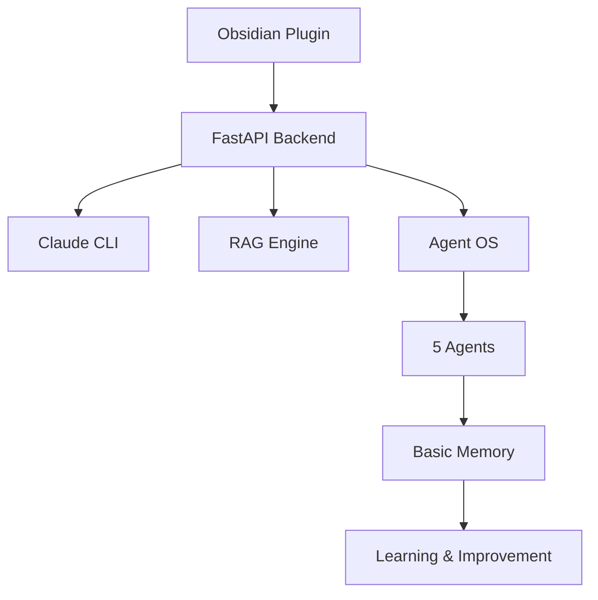

# 📚 Obsidian Copilot Documentation

> Complete documentation for Obsidian Copilot with Claude + Agent OS

## 🚀 Quick Links

| Getting Started | Core Features | Advanced |
|-----------------|---------------|----------|
| [Installation Guide](./setup/installation.md) | [Basic Usage](./usage/basic-usage.md) | [Agent Commands](./usage/agent-commands.md) |
| [Quick Start (5 min)](./setup/quick-start.md) | [Getting Started](./usage/getting-started.md) | [Advanced Features](./usage/advanced.md) |
| [Requirements](./setup/requirements.md) | [Daily Workflows](./usage/basic-usage.md#daily-workflows) | [API Reference](./architecture/api-reference.md) |

## 📖 Documentation Structure

### 🛠️ Setup & Installation
- **[Requirements](./setup/requirements.md)** - System requirements and prerequisites
- **[Installation Guide](./setup/installation.md)** - Complete step-by-step setup
- **[Quick Start](./setup/quick-start.md)** - Get running in 5 minutes

### 👤 Usage Guides
- **[Getting Started](./usage/getting-started.md)** - Your first 10 minutes
- **[Basic Usage](./usage/basic-usage.md)** - Core features and commands
- **[Agent Commands](./usage/agent-commands.md)** - Complete agent reference
- **[Advanced Features](./usage/advanced.md)** - Power user features

### 🤖 Agent Documentation
- **[Agent Overview](./agents/overview.md)** - Understanding the Agent OS
- **[Vault Analyzer](./agents/vault-analyzer.md)** - Autonomous vault analysis
- **[Synthesis Assistant](./agents/synthesis.md)** - Multi-document synthesis
- **[Context Optimizer](./agents/context-optimizer.md)** - Performance optimization
- **[Suggestion Engine](./agents/suggestions.md)** - Proactive recommendations
- **[Research Assistant](./agents/research.md)** - Deep research capabilities

### 🏗️ Architecture & Technical
- **[System Design](./architecture/system-design.md)** - Architecture overview
- **[Agent Memory](./architecture/agent-memory.md)** - How agents learn
- **[API Reference](./architecture/api-reference.md)** - Complete API documentation

### 🔧 Troubleshooting
- **[Common Issues](./troubleshooting/common-issues.md)** - Solutions to frequent problems
- **[FAQ](./troubleshooting/faq.md)** - Frequently asked questions

## 🎯 Start Here

### New Users
1. Check [Requirements](./setup/requirements.md)
2. Follow [Installation Guide](./setup/installation.md)
3. Read [Getting Started](./usage/getting-started.md)
4. Explore [Basic Usage](./usage/basic-usage.md)

### Experienced Users
1. Use [Quick Start](./setup/quick-start.md)
2. Jump to [Agent Commands](./usage/agent-commands.md)
3. Explore [Advanced Features](./usage/advanced.md)

### Developers
1. Review [System Design](./architecture/system-design.md)
2. Check [API Reference](./architecture/api-reference.md)
3. Understand [Agent Memory](./architecture/agent-memory.md)

## 🌟 Key Features

### Claude Integration
- 200K context window utilization
- Three context strategies
- Local processing via CLI
- Optimized for knowledge work

### Agent OS
- 5 specialized autonomous agents
- Continuous learning via Basic Memory
- Pattern detection and insights
- Proactive suggestions

### RAG System
- Dual search (OpenSearch + Semantic)
- Graph-aware retrieval
- Smart chunking strategies
- Cache optimization

## 📊 System Overview

## 🔗 External Resources

### Related Projects
- [Original Obsidian Copilot](https://github.com/logancyang/obsidian-copilot)
- [Basic Memory MCP](https://github.com/waldzx/basic-memory)
- [Claude by Anthropic](https://claude.ai)

### Community
- [GitHub Issues](https://github.com/caioniehues/obsidian-copilot/issues)
- [Discussions](https://github.com/caioniehues/obsidian-copilot/discussions)

## 📝 Documentation Status

| Section | Status | Last Updated |
|---------|--------|--------------|
| Setup & Installation | ✅ Complete | 2025-08-18 |
| Usage Guides | ✅ Complete | 2025-08-18 |
| Agent Documentation | ✅ Complete | 2025-08-18 |
| Architecture | ✅ Complete | 2025-08-18 |
| Troubleshooting | ✅ Complete | 2025-08-18 |

## 🤝 Contributing to Docs

Found an issue or want to improve documentation?
1. Check existing [issues](https://github.com/caioniehues/obsidian-copilot/issues)
2. Submit corrections via pull request
3. Suggest improvements in discussions

---

**Navigation**: [Home](../README.md) | [Setup](./setup/installation.md) →