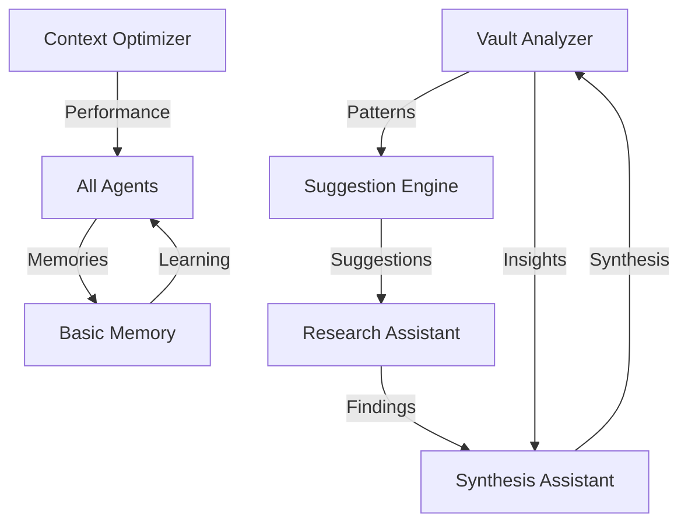

# 🤖 Agent OS Overview

> Understanding the autonomous agent system that powers Obsidian Copilot

## What is Agent OS?

Agent OS is an intelligent system of 5 specialized agents that work autonomously and collaboratively to enhance your knowledge management. Unlike traditional tools that only respond to queries, these agents:

- **Learn** from your interactions and improve over time
- **Work autonomously** even when you're not using Obsidian
- **Share knowledge** with each other through Basic Memory
- **Proactively suggest** improvements and connections
- **Remember** patterns, preferences, and insights

## The Five Agents

### 1. 🔍 Vault Analyzer
**Role**: Your knowledge archaeologist  
**Type**: Autonomous  
**Schedule**: Runs daily at 2 AM  

Continuously excavates insights from your vault, identifying patterns, connections, and opportunities you might miss.

### 2. 📝 Synthesis Assistant  
**Role**: Your knowledge weaver  
**Type**: Reactive  
**Trigger**: On-demand commands  

Combines multiple documents into coherent narratives, creating new understanding from scattered information.

### 3. ⚡ Context Optimizer
**Role**: Your performance engineer  
**Type**: Background  
**Schedule**: Continuous monitoring  

Works behind the scenes to make everything faster and more efficient, learning from usage patterns.

### 4. 💡 Suggestion Engine
**Role**: Your thinking partner  
**Type**: Proactive  
**Trigger**: Context-aware  

Watches as you work and provides timely suggestions, helping you discover connections and opportunities.

### 5. 🔬 Research Assistant
**Role**: Your investigation specialist  
**Type**: Interactive  
**Trigger**: On-demand commands  

Conducts deep, systematic research across your knowledge base, building evidence and testing hypotheses.

## How Agents Work Together



### Collaboration Examples

**Pattern Discovery → Suggestion**
1. Vault Analyzer detects you write about AI ethics weekly
2. Shares pattern with Suggestion Engine
3. Suggestion Engine proactively offers related content on Wednesdays

**Research → Synthesis → Analysis**
1. Research Assistant investigates a topic
2. Synthesis Assistant combines findings
3. Vault Analyzer identifies new patterns from synthesis

**Optimization → Performance**
1. Context Optimizer notices slow queries on large documents
2. Adjusts caching strategy
3. All agents benefit from faster retrieval

## Agent Memory System

### How Agents Learn

Agents store memories in your vault through Basic Memory:

```
agent-os/memory/
├── patterns/        # Recurring behaviors
├── preferences/     # User preferences  
├── executions/      # Task history
├── insights/        # Generated insights
├── feedback/        # User responses
└── optimizations/   # Performance improvements
```

### Memory Types

| Type | Purpose | Example |
|------|---------|---------|
| **Pattern** | Recognize recurring behaviors | "User researches AI ethics every Wednesday" |
| **Preference** | Customize responses | "User prefers bullet-point summaries" |
| **Execution** | Track performance | "Synthesis of 5 docs took 3.2 seconds" |
| **Insight** | Store discoveries | "Strong connection between notes A and B" |
| **Feedback** | Learn from responses | "User liked chronological format" |

### Memory Format

Each memory is stored as semantic markdown:

```markdown
# Pattern Memory
**Agent**: vault-analyzer
**Created**: 2024-01-15T10:30:00
**Type**: pattern

## Observations
- [pattern] Weekly review notes every Sunday
- [frequency] 12 occurrences
- [confidence] 0.92 confidence level

## Relations
- relates_to [[Work Habits]]
- influences [[Planning System]]
- supports [[GTD Methodology]]
```

## Agent Lifecycle

### Daily Cycle

```
2:00 AM  → Vault Analyzer runs
2:45 AM  → Analysis complete, report generated
9:00 AM  → You check morning report
9:15 AM  → Suggestion Engine activates
All day  → Context Optimizer monitors
On-demand → Research & Synthesis respond
Evening  → Patterns shared between agents
Overnight → Learning consolidated
```

### Learning Progression

**Day 1-3: Observation Phase**
- Agents observe your vault structure
- Build initial indices and connections
- Learn basic patterns

**Day 4-7: Pattern Recognition**
- Detect recurring behaviors
- Identify preferred workflows
- Build preference profiles

**Week 2-4: Optimization**
- Refine suggestions based on feedback
- Optimize performance for your vault
- Develop specialized knowledge

**Month 2+: Mastery**
- Anticipate needs before you ask
- Provide highly personalized insights
- Complex multi-agent collaborations

## Agent Intelligence

### Context Awareness

Agents understand:
- **Temporal context**: What you're working on now vs. historically
- **Semantic context**: Meaning and relationships between concepts
- **Task context**: Your goals and workflows
- **Personal context**: Your preferences and patterns

### Decision Making

Agents make decisions based on:
1. **Relevance scoring**: Mathematical relevance to current context
2. **Historical patterns**: What worked before
3. **User preferences**: Learned preferences
4. **Performance metrics**: What's most efficient
5. **Collaborative input**: Information from other agents

### Learning Mechanisms

**Reinforcement Learning**
- Positive feedback strengthens behaviors
- Negative feedback reduces behaviors
- Neutral interactions maintain status quo

**Pattern Recognition**
- Frequency analysis of behaviors
- Temporal pattern detection
- Semantic clustering of concepts

**Preference Modeling**
- Implicit learning from usage
- Explicit learning from feedback
- Continuous refinement

## Configuration

### Global Settings

In `.agent-os/agents/config.yaml`:

```yaml
global:
  enabled: true
  max_concurrent_agents: 3
  default_timeout: 60
  claude_model: claude-3-5-sonnet-20241022
  max_context_tokens: 150000
```

### Individual Agent Configuration

```yaml
agents:
  vault-analyzer:
    enabled: true
    trigger:
      type: schedule
      interval: daily
      time: "02:00"
    configuration:
      max_documents_per_run: 100
      analysis_depth: 3
```

### Performance Tuning

For different vault sizes:

**Small Vaults (<100 notes)**
```yaml
max_concurrent_agents: 5
analysis_depth: 5
cache_size_mb: 100
```

**Medium Vaults (100-1000 notes)**
```yaml
max_concurrent_agents: 3
analysis_depth: 3
cache_size_mb: 500
```

**Large Vaults (1000+ notes)**
```yaml
max_concurrent_agents: 2
analysis_depth: 2
cache_size_mb: 1000
```

## Privacy and Security

### Data Handling

- **Local Processing**: All agent processing happens locally
- **No External Storage**: Memories stored in your vault
- **No Telemetry**: No usage data collected
- **API Security**: Only Claude API calls leave your machine

### Memory Privacy

- Agent memories are markdown files in your vault
- You control what agents remember
- Can delete any memory at any time
- Can disable memory for specific agents

## Monitoring Agents

### Check Status

```bash
# List all agents
curl http://localhost:8000/agents/list

# Specific agent status
curl http://localhost:8000/agents/vault-analyzer/status

# Execution history
curl http://localhost:8000/agents/vault-analyzer/history
```

### View Memories

In Obsidian, search for:
- `tag:#agent:vault-analyzer` - Specific agent memories
- `tag:#type:pattern` - All patterns
- `tag:#type:insight` - All insights

### Performance Metrics

Check daily reports for:
- Patterns detected
- Suggestions accepted
- Synthesis quality
- Research depth
- Cache hit rates

## Best Practices

### Getting Started
1. Let agents observe for 3-5 days
2. Review initial reports and suggestions
3. Provide feedback on suggestions
4. Run manual analyses on important topics

### Ongoing Usage
1. Check daily analysis reports
2. Use synthesis for complex documents
3. Follow suggestions during exploration
4. Research before new projects

### Optimization
1. Disable unused agents to save resources
2. Adjust schedules based on your workflow
3. Clear old memories periodically
4. Update configurations as vault grows

## Troubleshooting

### Agents Not Running
- Check if enabled in config
- Verify scheduler is running
- Review logs for errors

### Poor Quality Suggestions
- Allow more learning time (1 week minimum)
- Provide explicit feedback
- Check if enough memories accumulated

### Performance Issues
- Reduce concurrent agents
- Lower token limits
- Disable real-time agents temporarily

## Future Capabilities

### Planned Enhancements
- Visual dashboard for agent activity
- Custom agent creation framework
- External tool integration
- Multi-user collaboration
- Agent conversation mode

### Research Areas
- Advanced learning algorithms
- Cross-vault knowledge sharing
- Predictive task automation
- Natural language agent programming

---

**Navigation**: [← Documentation](../README.md) | [Vault Analyzer →](./vault-analyzer.md)