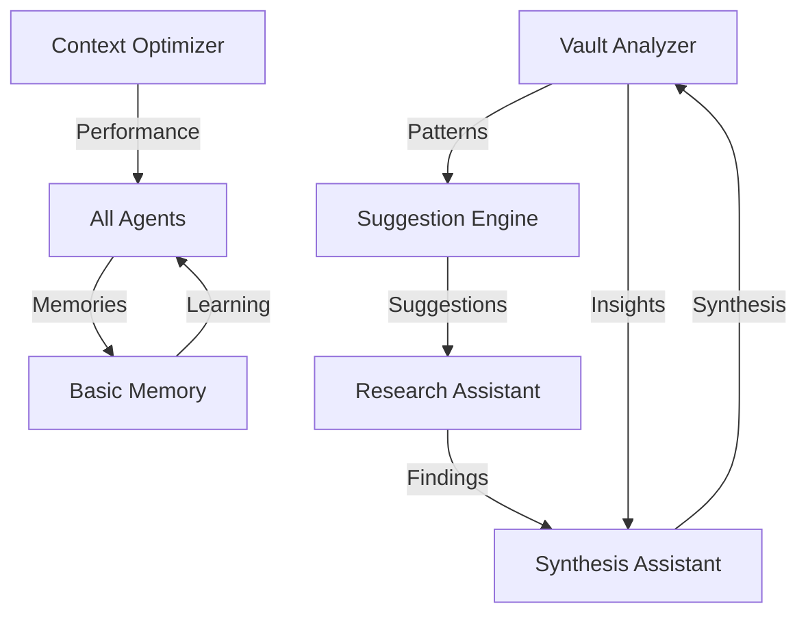

# 🤖 Agent OS Overview

> Understanding the autonomous agent system that powers Obsidian Copilot

## What is Agent OS?

Agent OS is an intelligent system of 5 specialized agents that work autonomously and collaboratively to enhance your knowledge management. Unlike traditional tools that only respond to queries, these agents:

- **Learn** from your interactions and improve over time
- **Work autonomously** even when you're not using Obsidian
- **Share knowledge** with each other through Basic Memory
- **Proactively suggest** improvements and connections
- **Remember** patterns, preferences, and insights

## The Five Agents

### 1. 🔍 Vault Analyzer
**Role**: Your knowledge archaeologist  
**Type**: Autonomous  
**Schedule**: Runs daily at 2 AM  

Continuously excavates insights from your vault, identifying patterns, connections, and opportunities you might miss.

**Key Capabilities:**
- **Pattern Detection**: Identifies recurring themes and concepts across your vault
- **Connection Discovery**: Finds non-obvious relationships between disparate notes
- **Knowledge Gap Analysis**: Identifies areas where information is missing or incomplete
- **Trend Identification**: Detects emerging topics and evolving themes over time
- **Quality Assessment**: Evaluates the completeness and interconnectedness of notes

**Daily Analysis Protocol:**
1. **Data Collection** (0-10 min): Gather changed notes and metadata
2. **Pattern Analysis** (10-20 min): Extract themes, analyze links and tags
3. **Deep Analysis** (20-30 min): Semantic clustering, knowledge graph analysis
4. **Insight Generation** (30-40 min): Generate connections and gap identification
5. **Report Generation** (40-45 min): Create comprehensive markdown report

**Output Example:**
```markdown
# Daily Vault Analysis Report
Date: 2024-01-15
Notes Analyzed: 127

## Executive Summary
- Emerging theme: "Agent architectures" (15 new mentions)
- Knowledge gap: Missing documentation on error handling
- Connection opportunity: Link "AI Ethics" notes with "Agent Design"

## New Patterns Detected
### Theme: Autonomous Systems
- Related notes: [[Agent Design]], [[Self-Learning Systems]]
- Growth: 300% over last week
```

### 2. 📝 Synthesis Assistant  
**Role**: Your knowledge weaver  
**Type**: Reactive  
**Trigger**: On-demand commands  

Combines multiple documents into coherent narratives, creating new understanding from scattered information.

**Key Capabilities:**
- **Multi-Document Synthesis**: Combine insights from 2-50 documents
- **Thematic Synthesis**: Organize information by themes
- **Chronological Synthesis**: Create timelines from scattered events
- **Argumentative Synthesis**: Build coherent arguments from evidence
- **Comparative Synthesis**: Compare and contrast perspectives

**Synthesis Strategies:**

**Thematic Synthesis**
Groups and organizes information by themes:
- Identifies major themes across documents
- Creates hierarchical theme structures
- Maps sub-themes and variations

**Chronological Synthesis**
Organizes information temporally:
- Creates timelines from scattered events
- Tracks development of ideas over time
- Identifies causal chains

**Argumentative Synthesis**
Builds coherent arguments:
- Collects supporting evidence
- Identifies counter-arguments
- Evaluates argument strength

**Command Usage:**
```markdown
## agent:synthesize
Synthesize my notes on machine learning

## agent:synthesize type=chronological
Create a timeline of my project notes

## agent:synthesize type=comparative
Compare perspectives on remote work
```

### 3. ⚡ Context Optimizer
**Role**: Your performance engineer  
**Type**: Background  
**Schedule**: Continuous monitoring (checks every 5 minutes)  

Works behind the scenes to make everything faster and more efficient, learning from usage patterns.

**Key Capabilities:**
- **Index Optimization**: Maintains search indices for peak performance
- **Cache Management**: Intelligent caching of frequently accessed content
- **Query Pattern Learning**: Learns from usage to improve future queries
- **Token Allocation**: Optimizes Claude's 200K context window usage
- **Performance Tuning**: Continuously improves response times

**Token Budget Allocation:**
```
Critical Context:     40% (60K tokens)
Relevant Context:     30% (45K tokens)
Supporting Context:   20% (30K tokens)
Peripheral Context:   10% (15K tokens)
```

**Cache Architecture:**
- **Hot Cache** (Memory): 100MB, 1-hour TTL
- **Warm Cache** (Redis): 500MB, 24-hour TTL
- **Cold Cache** (Disk): 2GB, 7-day TTL

**Performance Metrics:**
- Query latency p50: < 500ms
- Cache hit rate: > 60%
- Token utilization: > 80%
- Context quality score: > 0.75

### 4. 💡 Suggestion Engine
**Role**: Your thinking partner  
**Type**: Proactive  
**Trigger**: Context-aware (monitors active note changes)  

Watches as you work and provides timely suggestions, helping you discover connections and opportunities.

**Key Capabilities:**
- **Related Content Discovery**: Find conceptually related documents
- **Query Enhancement**: Suggest improved search strategies
- **Workflow Optimization**: Recommend next actions
- **Knowledge Gap Alerts**: Identify missing information
- **Pattern Recognition**: Highlight emerging patterns

**Suggestion Types:**

**Content Suggestions**
```markdown
## Related Note Found
**Title**: Advanced RAG Techniques
**Relevance**: 92%
**Why this matters**: Contains complementary research 
that extends your current analysis on retrieval systems.
```

**Analysis Suggestions**
```markdown
## Synthesis Opportunity Detected
**Documents**: 5 related notes on AI ethics
**Potential insights**:
- Convergent ideas across notes
- Unresolved contradictions
**Suggested action**: Create synthesis focusing on practical applications
```

**Timing Strategy:**
- **Optimal moments**: After queries, during pauses, at section boundaries
- **Avoid interrupting**: Active typing, rapid navigation, focused reading
- **Debounce**: 2-second delay to prevent overwhelming

### 5. 🔬 Research Assistant
**Role**: Your investigation specialist  
**Type**: Interactive  
**Trigger**: On-demand commands  

Conducts deep, systematic research across your knowledge base, building evidence and testing hypotheses.

**Key Capabilities:**
- **Literature Review**: Systematic analysis of all relevant sources
- **Evidence Gathering**: Build evidence chains from multiple sources
- **Hypothesis Testing**: Test ideas against vault knowledge
- **Citation Tracking**: Follow citation networks
- **Research Planning**: Create structured research plans

**Research Depth Levels:**

| Level | Documents | Depth | Time | Use Case |
|-------|-----------|-------|------|----------|
| **Exploratory** | Up to 100 | Broad survey | 30 min | Initial research |
| **Focused** | Up to 20 | Deep dive | 15 min | Specific topics |
| **Comprehensive** | Up to 200 | Exhaustive | 60 min | Publication-ready |

**Research Process:**
1. **Query Analysis**: Break down research question
2. **Search Strategy**: Multi-pronged search approach
3. **Evidence Collection**: Systematic gathering
4. **Analysis & Synthesis**: Theme and argument analysis
5. **Report Generation**: Comprehensive markdown report

**Command Usage:**
```markdown
## agent:research
Research the evolution of transformer architectures

## agent:research depth=comprehensive
Exhaustive analysis of productivity systems

## agent:research type=hypothesis
Test hypothesis: "Spaced repetition improves long-term retention"
```

## How Agents Work Together



### Inter-Agent Communication

Agents share information through Basic Memory using this coordination flow:

```
Vault Analyzer → discovers patterns → Suggestion Engine
                                    ↓
                            suggests synthesis
                                    ↓
Synthesis Assistant ← retrieves context ← Context Optimizer
                    ↓
            creates synthesis
                    ↓
Research Assistant ← learns from synthesis patterns
```

### Priority System

When multiple agents need resources:
1. **Context Optimizer** (highest priority - maintains performance)
2. **Vault Analyzer** (scheduled, important insights)
3. **Suggestion Engine** (user-facing, real-time)
4. **Synthesis Assistant** (on-demand, can wait)
5. **Research Assistant** (resource-intensive, lowest priority)

### Collaboration Examples

**Pattern Discovery → Suggestion**
1. Vault Analyzer detects you write about AI ethics weekly
2. Shares pattern with Suggestion Engine
3. Suggestion Engine proactively offers related content on Wednesdays

**Research → Synthesis → Analysis**
1. Research Assistant investigates a topic
2. Synthesis Assistant combines findings
3. Vault Analyzer identifies new patterns from synthesis

**Optimization → Performance**
1. Context Optimizer notices slow queries on large documents
2. Adjusts caching strategy
3. All agents benefit from faster retrieval

## Agent Memory System

### How Agents Learn

Agents store memories in your vault through Basic Memory:

```
agent-os/memory/
├── patterns/        # Recurring behaviors
├── preferences/     # User preferences  
├── executions/      # Task history
├── insights/        # Generated insights
├── feedback/        # User responses
└── optimizations/   # Performance improvements
```

### Memory Types

| Type | Purpose | Example |
|------|---------|---------|
| **Pattern** | Recognize recurring behaviors | "User researches AI ethics every Wednesday" |
| **Preference** | Customize responses | "User prefers bullet-point summaries" |
| **Execution** | Track performance | "Synthesis of 5 docs took 3.2 seconds" |
| **Insight** | Store discoveries | "Strong connection between notes A and B" |
| **Feedback** | Learn from responses | "User liked chronological format" |

### Memory Format

Each memory is stored as semantic markdown:

```markdown
# Pattern Memory
**Agent**: vault-analyzer
**Created**: 2024-01-15T10:30:00
**Type**: pattern

## Observations
- [pattern] Weekly review notes every Sunday
- [frequency] 12 occurrences
- [confidence] 0.92 confidence level

## Relations
- relates_to [[Work Habits]]
- influences [[Planning System]]
- supports [[GTD Methodology]]
```

## Agent Lifecycle

### Daily Cycle

```
2:00 AM  → Vault Analyzer runs
2:45 AM  → Analysis complete, report generated
9:00 AM  → You check morning report
9:15 AM  → Suggestion Engine activates
All day  → Context Optimizer monitors
On-demand → Research & Synthesis respond
Evening  → Patterns shared between agents
Overnight → Learning consolidated
```

### Learning Progression

**Day 1-3: Observation Phase**
- Agents observe your vault structure
- Build initial indices and connections
- Learn basic patterns

**Day 4-7: Pattern Recognition**
- Detect recurring behaviors
- Identify preferred workflows
- Build preference profiles

**Week 2-4: Optimization**
- Refine suggestions based on feedback
- Optimize performance for your vault
- Develop specialized knowledge

**Month 2+: Mastery**
- Anticipate needs before you ask
- Provide highly personalized insights
- Complex multi-agent collaborations

## Agent Intelligence

### Context Awareness

Agents understand:
- **Temporal context**: What you're working on now vs. historically
- **Semantic context**: Meaning and relationships between concepts
- **Task context**: Your goals and workflows
- **Personal context**: Your preferences and patterns

### Decision Making

Agents make decisions based on:
1. **Relevance scoring**: Mathematical relevance to current context
2. **Historical patterns**: What worked before
3. **User preferences**: Learned preferences
4. **Performance metrics**: What's most efficient
5. **Collaborative input**: Information from other agents

### Learning Mechanisms

**Reinforcement Learning**
- Positive feedback strengthens behaviors
- Negative feedback reduces behaviors
- Neutral interactions maintain status quo

**Pattern Recognition**
- Frequency analysis of behaviors
- Temporal pattern detection
- Semantic clustering of concepts

**Preference Modeling**
- Implicit learning from usage
- Explicit learning from feedback
- Continuous refinement

## Configuration

### Global Settings

In `.agent-os/agents/config.yaml`:

```yaml
global:
  enabled: true
  max_concurrent_agents: 3
  default_timeout: 60
  claude_model: claude-3-5-sonnet-20241022
  max_context_tokens: 150000
```

### Individual Agent Configuration

```yaml
agents:
  vault-analyzer:
    enabled: true
    trigger:
      type: schedule
      interval: daily
      time: "02:00"
    configuration:
      max_documents_per_run: 100
      analysis_depth: 3
```

### Performance Tuning

#### Global Performance Settings
```yaml
global:
  max_concurrent_agents: 2  # Reduce concurrent execution
  default_timeout: 30       # Shorter timeout  
  max_context_tokens: 100000  # Reduce token usage
```

#### Vault Size Optimization

**Small Vaults (<100 notes)**
```yaml
max_concurrent_agents: 5
analysis_depth: 5
cache_size_mb: 100
max_context_tokens: 200000
```

**Medium Vaults (100-1000 notes)**
```yaml
max_concurrent_agents: 3
analysis_depth: 3
cache_size_mb: 500
max_context_tokens: 150000
```

**Large Vaults (1000+ notes)**
```yaml
max_concurrent_agents: 2
analysis_depth: 2
cache_size_mb: 1000
max_context_tokens: 100000
batch_processing: true
```

## Privacy and Security

### Data Handling

- **Local Processing**: All agent processing happens locally
- **No External Storage**: Memories stored in your vault
- **No Telemetry**: No usage data collected
- **API Security**: Only Claude API calls leave your machine

### Memory Privacy

- Agent memories are markdown files in your vault
- You control what agents remember
- Can delete any memory at any time
- Can disable memory for specific agents

## API Usage

### Execute Agent Manually

```bash
curl -X POST http://localhost:8000/agents/vault-analyzer/execute \
  -H "Content-Type: application/json" \
  -d '{
    "parameters": {
      "depth": 3,
      "focus": "recent_changes"
    }
  }'
```

### Check Agent Status

```bash
curl http://localhost:8000/agents/vault-analyzer/status
```

### Get Agent History

```bash
curl http://localhost:8000/agents/vault-analyzer/history?limit=10
```

### View Schedule

```bash
curl http://localhost:8000/scheduler/info
```

## Monitoring Agents

### Check Status

```bash
# List all agents
curl http://localhost:8000/agents/list

# Specific agent status
curl http://localhost:8000/agents/vault-analyzer/status

# Execution history
curl http://localhost:8000/agents/vault-analyzer/history
```

### View Memories

In Obsidian, search for:
- `tag:#agent:vault-analyzer` - Specific agent memories
- `tag:#type:pattern` - All patterns
- `tag:#type:insight` - All insights

### Performance Metrics

Check daily reports for:
- Patterns detected
- Suggestions accepted
- Synthesis quality
- Research depth
- Cache hit rates

## Best Practices

### Getting Started
1. Let agents observe for 3-5 days
2. Review initial reports and suggestions
3. Provide feedback on suggestions
4. Run manual analyses on important topics

### Ongoing Usage
1. Check daily analysis reports
2. Use synthesis for complex documents
3. Follow suggestions during exploration
4. Research before new projects

### Optimization
1. Disable unused agents to save resources
2. Adjust schedules based on your workflow
3. Clear old memories periodically
4. Update configurations as vault grows

## Troubleshooting

### Agent Not Running

1. Check if enabled in config
2. Verify scheduler is running
3. Check agent status via API
4. Review logs for errors

### Poor Suggestions

1. Let agents accumulate more memories
2. Provide explicit feedback
3. Adjust confidence thresholds
4. Clear and rebuild patterns

### Performance Issues

1. Reduce concurrent agents
2. Lower token limits
3. Disable real-time agents temporarily
4. Optimize indices

> **💡 Tip**: For comprehensive troubleshooting, see [Troubleshooting Guide](./troubleshooting.md)

## Future Enhancements

### Planned Improvements
- **Visual Dashboard**: Real-time agent activity monitoring
- **Custom Agent Framework**: Create specialized agents for specific workflows
- **Workflow Automation**: Trigger-based automation for complex tasks
- **External Tool Integration**: Connect with Notion, Readwise, and other tools
- **Collaborative Multi-User Agents**: Share insights across team vaults

### Research Areas
- Advanced learning algorithms for better pattern recognition
- Cross-vault knowledge sharing and synchronization
- Predictive task automation based on user behavior
- Natural language agent programming and customization

---

**Navigation**: 
- [← Documentation](../README.md) 
- [API Reference →](./api-reference.md)
- [Troubleshooting →](./troubleshooting.md)
- [Individual Agent Guides →](./vault-analyzer.md)