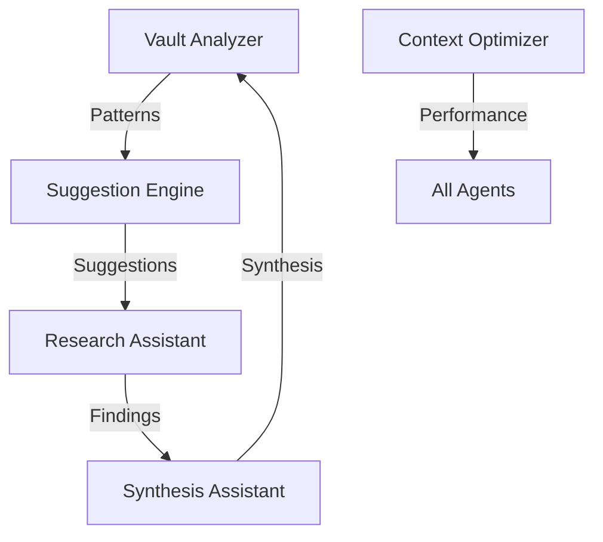

# Agent Overview

Understanding the 5 autonomous agents that power Obsidian Copilot.

## What are Agents?

Agents are autonomous AI assistants that:
- **Learn** from your vault and interactions
- **Work independently** even when you're not using Obsidian
- **Share knowledge** with each other
- **Improve over time** through Basic Memory
- **Proactively help** without being asked

## The Five Agents

### 1. 🔍 Vault Analyzer

**Type**: Autonomous  
**Schedule**: Daily at 2 AM  
**Purpose**: Analyze your entire vault for patterns and insights

**What it does:**
- Detects recurring themes and patterns
- Identifies knowledge gaps
- Finds connection opportunities
- Tracks vault evolution
- Generates daily reports

**Daily Report Location:**
```
Agent Reports/Daily Analysis/YYYY-MM-DD.md
```

### 2. 📝 Synthesis Assistant

**Type**: Reactive  
**Trigger**: On-demand commands  
**Purpose**: Combine multiple documents into coherent syntheses

**Capabilities:**
- Thematic synthesis - Group by themes
- Chronological synthesis - Create timelines
- Argumentative synthesis - Build arguments
- Comparative synthesis - Compare perspectives

**Example Commands:**
```markdown
## agent:synthesize
Basic synthesis

## agent:synthesize type=thematic
Group by themes

## agent:synthesize type=chronological
Create timeline
```

### 3. ⚡ Context Optimizer

**Type**: Background  
**Schedule**: Continuous (every 5 minutes)  
**Purpose**: Optimize performance and efficiency

**What it does:**
- Manages caching strategies
- Optimizes search indices
- Tunes relevance scoring
- Precomputes common queries
- Monitors performance

This agent works silently to make everything faster.

### 4. 💡 Suggestion Engine

**Type**: Proactive  
**Trigger**: Context-aware  
**Purpose**: Provide real-time suggestions

**Monitors:**
- Active note changes
- Query patterns
- Navigation history

**Provides:**
- Related note suggestions
- Query improvements
- Workflow enhancements
- Knowledge gap alerts

**Example:**
```markdown
## agent:suggest
What should I explore?

## agent:suggest type=related
Find related content
```

### 5. 🔬 Research Assistant

**Type**: Interactive  
**Trigger**: On-demand  
**Purpose**: Conduct deep research

**Research Modes:**

| Mode | Documents | Time | Use Case |
|------|-----------|------|----------|
| Exploratory | 100 | 30 min | Initial research |
| Focused | 20 | 15 min | Specific topics |
| Comprehensive | 200 | 60 min | Exhaustive analysis |

**Commands:**
```markdown
## agent:research
Basic research

## agent:research depth=comprehensive
Deep analysis

## agent:research type=hypothesis
Test hypothesis
```

## How Agents Collaborate



### Example Collaboration

1. **Vault Analyzer** detects you write about AI weekly
2. **Suggestion Engine** starts offering AI content on writing days
3. **Research Assistant** gathers related research
4. **Synthesis Assistant** combines findings
5. **Context Optimizer** caches frequent queries

## Agent Memory

Agents remember through Basic Memory:

### Memory Types

| Type | Purpose | Example |
|------|---------|---------|
| Pattern | Recurring behaviors | "User researches AI on Wednesdays" |
| Preference | User preferences | "Prefers bullet points" |
| Execution | Task history | "Synthesis took 3.2 seconds" |
| Insight | Discoveries | "Strong link between notes A and B" |
| Feedback | User responses | "User liked timeline format" |

### Viewing Memories

Search in Obsidian:
- `tag:#agent:vault-analyzer` - Specific agent
- `tag:#type:pattern` - All patterns
- `tag:#type:insight` - All insights

## Agent Configuration

Edit `.agent-os/agents/config.yaml`:

```yaml
agents:
  vault-analyzer:
    enabled: true
    trigger:
      interval: daily
      time: "02:00"
    configuration:
      max_documents: 100
      analysis_depth: 3
```

## Daily Agent Lifecycle

```
2:00 AM  → Vault Analyzer runs
2:45 AM  → Report generated
9:00 AM  → You check report
All day  → Suggestion Engine monitors
All day  → Context Optimizer tunes
On-demand → Research & Synthesis respond
Evening  → Agents share learnings
```

## Agent Commands Quick Reference

### Status Commands
```markdown
## agent:status
All agents status

## agent:config
View configuration

## agent:memories
View agent memories
```

### Control Commands
```markdown
## agent:enable vault-analyzer
Enable agent

## agent:disable suggestion-engine
Disable agent

## agent:reset-memory
Clear memories
```

## Best Practices

### Getting Started
1. Let agents observe for 3-5 days
2. Review initial reports
3. Provide feedback on suggestions
4. Run manual analyses

### Ongoing Use
1. Check daily reports
2. Use synthesis for documents
3. Follow suggestions
4. Research before projects

### Optimization
1. Disable unused agents
2. Adjust schedules
3. Clear old memories
4. Update configurations

## Next Steps

- Learn [[Basic Commands]]
- Explore [[Daily Workflows]]
- Read about individual agents:
  - [[Vault Analyzer]]
  - [[Synthesis Assistant]]
  - [[Suggestion Engine]]
  - [[Research Assistant]]

---

← [[Home]] | [[Basic Commands]] →