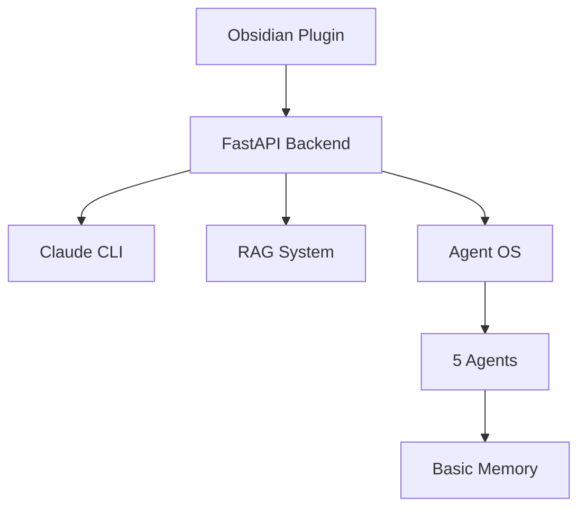

# Welcome to Obsidian Copilot Wiki

> An intelligent knowledge companion powered by Claude's 200K context window and autonomous agents

## What is Obsidian Copilot?

Obsidian Copilot transforms your Obsidian vault into an intelligent knowledge base with:
- **Claude Integration**: Leverages 200K token context window
- **5 Autonomous Agents**: Work independently to analyze and optimize
- **Semantic Memory**: Agents learn and improve over time
- **Privacy-First**: All processing local except Claude API calls

## Quick Navigation

### 📚 Getting Started
- [[Installation Guide]] - Complete setup instructions
- [[Quick Start]] - Get running in 5 minutes
- [[First Steps]] - Your first 30 minutes

### 🤖 Agents
- [[Agent Overview]] - Understanding the Agent OS
- [[Vault Analyzer]] - Daily analysis agent
- [[Synthesis Assistant]] - Multi-document synthesis
- [[Suggestion Engine]] - Proactive recommendations
- [[Research Assistant]] - Deep research capabilities

### 💡 Usage
- [[Basic Commands]] - Essential commands
- [[Daily Workflows]] - Integrate into your routine
- [[Advanced Features]] - Power user features

### 🔧 Reference
- [[API Documentation]] - Technical API reference
- [[Configuration]] - Customize your setup
- [[Troubleshooting]] - Common issues and solutions

## Quick Examples

### Basic Query
```markdown
## What is machine learning?
```

### Agent Commands
```markdown
## agent:synthesize
Create synthesis of my notes

## agent:research depth=comprehensive
Deep research on quantum computing

## agent:suggest
What should I explore next?
```

## System Architecture



## Support

- [GitHub Issues](https://github.com/caioniehues/obsidian-copilot/issues)
- [Discussions](https://github.com/caioniehues/obsidian-copilot/discussions)
- Check [[Troubleshooting]] for common problems

---

*This is a private fork of [obsidian-copilot](https://github.com/logancyang/obsidian-copilot) optimized for Claude + Agent OS*